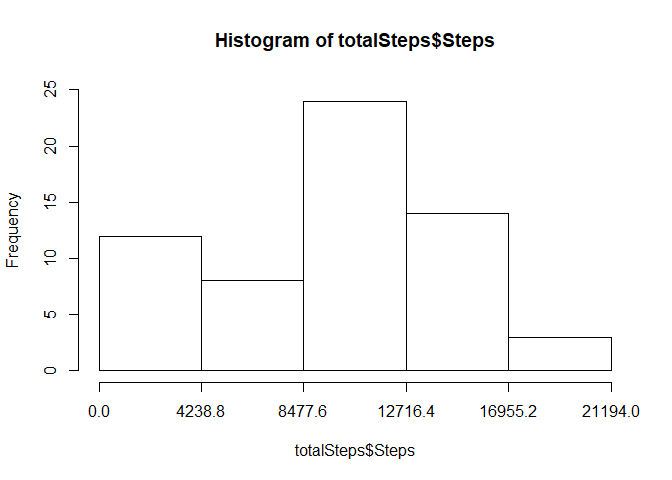
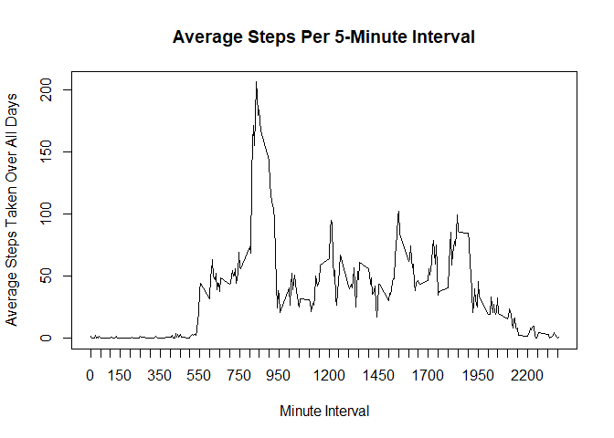
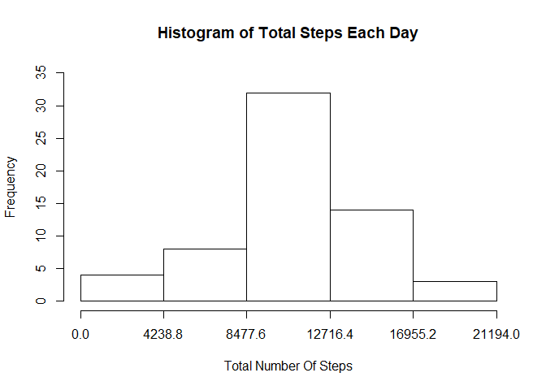
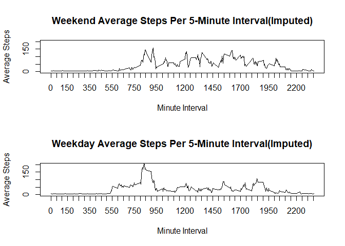

## Loading and preprocessing the data
#### Load the data

```r
library(dplyr)
library(Hmisc)
```

```r
cp1<-read.csv("../activity.csv", header=TRUE, stringsAsFactors = FALSE, colClasses = c("integer", "Date", "integer")) 
```
#### Process/transform the data

```r
totalSteps <- cp1 %>% group_by(date) %>% dplyr::summarize(Steps = sum(steps, na.rm=TRUE))
```
## What is mean total number of steps taken per day?
#### Make a histogram of the total number of steps taken each day

```r
hist(totalSteps$Steps,xaxt="n", breaks = seq(0, max(totalSteps$Steps), by = max(totalSteps$Steps) / 5), ylim=c(0,25))
axis(side=1, at=seq(0, max(totalSteps$Steps), max(totalSteps$Steps / 5)))
```

<!-- -->

#### Calculate and report the mean and median total number of steps taken per day

```r
meanSteps <- cp1 %>% group_by(date) %>% dplyr::summarize(Steps = mean(steps, na.rm=TRUE))
meanSteps
```

```
## # A tibble: 61 x 2
##    date         Steps
##    <date>       <dbl>
##  1 2012-10-01 NaN    
##  2 2012-10-02   0.438
##  3 2012-10-03  39.4  
##  4 2012-10-04  42.1  
##  5 2012-10-05  46.2  
##  6 2012-10-06  53.5  
##  7 2012-10-07  38.2  
##  8 2012-10-08 NaN    
##  9 2012-10-09  44.5  
## 10 2012-10-10  34.4  
## # ... with 51 more rows
```

```r
medianSteps <- cp1 %>% group_by(date) %>% dplyr::summarize(Steps = median(steps, na.rm=TRUE))
```

```
## Warning: package 'bindrcpp' was built under R version 3.4.4
```

```r
medianSteps
```

```
## # A tibble: 61 x 2
##    date       Steps
##    <date>     <dbl>
##  1 2012-10-01   NA 
##  2 2012-10-02    0.
##  3 2012-10-03    0.
##  4 2012-10-04    0.
##  5 2012-10-05    0.
##  6 2012-10-06    0.
##  7 2012-10-07    0.
##  8 2012-10-08   NA 
##  9 2012-10-09    0.
## 10 2012-10-10    0.
## # ... with 51 more rows
```
## What is the average daily activity pattern?

```r
avgStepsPerInt <- cp1 %>% group_by(interval) %>% dplyr::summarize(Steps = mean(steps, na.rm=TRUE))
```
#### Make a time series plot of the 5-minute interval and the average number of steps taken, averaged across all days

```r
plot(avgStepsPerInt$interval, avgStepsPerInt$Steps, type="l", xaxt="n", xlab="Minute Interval", ylab="Average Steps Taken Over All Days", main="Average Steps Per 5-Minute Interval")
axis(side=1, at=seq(0, max(avgStepsPerInt$interval), 50))
```

<!-- -->

#### Which 5-minute interval, on average across all the days in the dataset, contains the maximum number of steps?

```r
maxStepsInterval <- avgStepsPerInt[avgStepsPerInt$Steps == max(avgStepsPerInt$Steps), 1]
maxStepsInterval
```

```
## # A tibble: 1 x 1
##   interval
##      <int>
## 1      835
```
## Imputing missing values
#### Calculate and report the total number of missing values in the dataset

```r
naTotal<-sum(is.na(cp1))
naTotal
```

```
## [1] 2304
```
#### Create a new dataset that is equal to the original dataset but with the missing data filled in.

```r
cp1Filled <- cp1
cp1Filled$impSteps <- with(cp1Filled, impute(steps, mean))
avgStepsFilled <- cp1Filled %>% group_by(interval) %>% dplyr::summarize(impSteps = mean(impSteps, na.rm=TRUE))
```
#### Make a histogram of the total number of steps taken each day and Calculate and report the mean and median total number of steps taken per day.

```r
totalStepsFilled <- cp1Filled %>% group_by(date) %>% dplyr::summarize(Steps = sum(impSteps, na.rm=TRUE))
hist(totalStepsFilled$Steps, xaxt="n", breaks = seq(0, max(totalStepsFilled$Steps), by = max(totalStepsFilled$Steps) / 5), 
     ylim=c(0,35), xlab="Total Number Of Steps", ylab="Frequency", main="Histogram of Total Steps Each Day")
axis(side=1, at=seq(0, max(totalStepsFilled$Steps), max(totalStepsFilled$Steps / 5)))
```

<!-- -->

```r
meanSteps <- cp1Filled %>% group_by(date) %>% dplyr::summarize(Steps = mean(impSteps, na.rm=TRUE))
meanSteps
```

```
## # A tibble: 61 x 2
##    date        Steps
##    <date>      <dbl>
##  1 2012-10-01 37.4  
##  2 2012-10-02  0.438
##  3 2012-10-03 39.4  
##  4 2012-10-04 42.1  
##  5 2012-10-05 46.2  
##  6 2012-10-06 53.5  
##  7 2012-10-07 38.2  
##  8 2012-10-08 37.4  
##  9 2012-10-09 44.5  
## 10 2012-10-10 34.4  
## # ... with 51 more rows
```

```r
medianSteps <- cp1Filled %>% group_by(date) %>% dplyr::summarize(Steps = median(impSteps, na.rm=TRUE))
medianSteps
```

```
## # A tibble: 61 x 2
##    date       Steps
##    <date>     <dbl>
##  1 2012-10-01  37.4
##  2 2012-10-02   0. 
##  3 2012-10-03   0. 
##  4 2012-10-04   0. 
##  5 2012-10-05   0. 
##  6 2012-10-06   0. 
##  7 2012-10-07   0. 
##  8 2012-10-08  37.4
##  9 2012-10-09   0. 
## 10 2012-10-10   0. 
## # ... with 51 more rows
```
####  Do these values differ from the estimates from the first part of the assignment? What is the impact of imputing missing data on the estimates of the total daily number of steps?
##### Yes the values differ.  There are more frequent values in higher ranges. 

## Are there differences in activity patterns between weekdays and weekends?
#### Create a new factor variable in the dataset with two levels -- "weekday" and "weekend" indicating whether a given date is a weekday or weekend day.

```r
weekdays1 <- c('Monday', 'Tuesday', 'Wednesday', 'Thursday', 'Friday')
cp1Filled$DayType <- factor((weekdays(cp1Filled$date) %in% weekdays1), 
                               levels=c(FALSE, TRUE), labels=c('weekend', 'weekday')) 
avgStepsFilledWkDay <- cp1Filled %>% group_by(DayType, interval) %>% dplyr::summarize(impSteps = mean(impSteps, na.rm=TRUE))   
```
#### Make a panel plot containing a time series plot (i.e. type = "l") of the 5-minute interval (x-axis) and the average number of steps taken, averaged across all weekday days or weekend days (y-axis)

```r
par(mfrow=c(2,1))
with(avgStepsFilledWkDay[avgStepsFilledWkDay$DayType!="weekday",], plot(interval, impSteps, type="l", xaxt="n", ylim=c(0,200), xlab="Minute Interval", ylab="Average Steps", main="Weekend Average Steps Per 5-Minute Interval(Imputed)"))
axis(side=1, at=seq(0, max(avgStepsFilledWkDay$interval), 50))
with(avgStepsFilledWkDay[avgStepsFilledWkDay$DayType=="weekday",], plot(interval, impSteps, type="l", xaxt="n", ylim=c(0,200), xlab="Minute Interval", ylab="Average Steps", main="Weekday Average Steps Per 5-Minute Interval(Imputed)"))
axis(side=1, at=seq(0, max(avgStepsFilledWkDay$interval), 50))
```

<!-- -->

